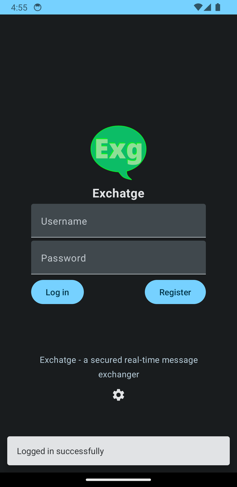
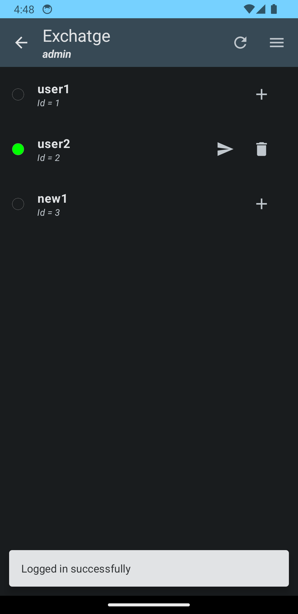
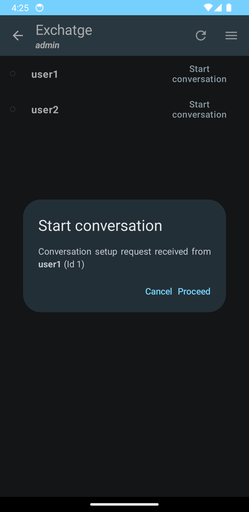
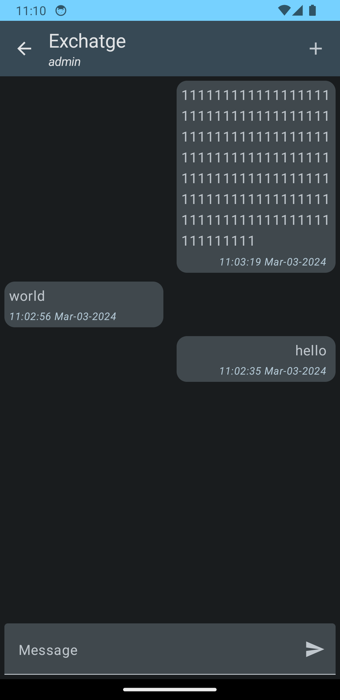

# Exchatge - a secured message exchanger (android client)

```
_______ _     _ _______ _     _ _______ _______  ______ _______
|______  \___/  |       |_____| |_____|    |    |  ____ |______
|______ _/   \_ |_____  |     | |     |    |    |_____| |______
```

This is an android port of the [desktop client for linux systems](https://github.com/vadniks/ExchatgeDesktopClient).
[The server](https://github.com/vadniks/ExchatgeServer).

## Project is currently under active development

## Concept screenshots






